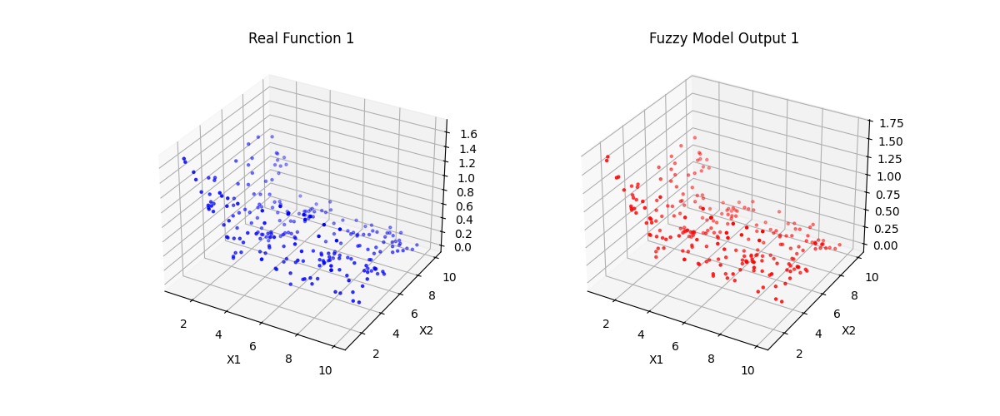

# گزارش تمرین ۴: تقریب تابع با سیستم استنتاج فازی (Mamdani)

## ۱. هدف و صورت مسئله
هدف این تمرین، مدل‌سازی دو تابع ریاضی غیرخطی زیر با استفاده از سیستم فازی ممدانی است:
1.  **تابع ۱:** شامل جملات سینوسی (نوسانی).
2.  **تابع ۲:** شامل توان‌های منفی (تغییرات شدید).

## ۲. روش پیاده‌سازی
برای حل مسئله از روش **Wang-Mendel** (تولید قوانین از داده‌ها) استفاده شد. مشخصات مدل به شرح زیر است:

*   **داده‌ها:** تولید ۸۰۰ داده تصادفی در بازه $[1, 10]$.
*   **تقسیم‌بندی:** ۷۰٪ آموزش (Train) و ۳۰٪ تست (Test).
*   **توابع عضویت:** برای هر متغیر ورودی و خروجی، **۱۵ تابع عضویت مثلثی** (Partition) در نظر گرفته شد.
*   **روش ارزیابی:** مدل در دو حالت ارزیابی شد:
    1.  **با خروجی فازی:** استفاده از میانگین وزنی مراکز (دقیق‌تر).
    2.  **بدون خروجی فازی:** استفاده از خروجیِ قوی‌ترین قانون (ساده‌تر).

## ۳. نتایج عددی
معیارهای **FVU** (میزان خطا) و **PCC** (همبستگی) روی داده‌های تست محاسبه شدند:

| تابع | حالت | FVU (خطا) | PCC (همبستگی) | تحلیل |
| :--- | :--- | :---: | :---: | :--- |
| **تابع ۱** | با خروجی فازی | **0.0296** | **0.9861** | مدل بسیار دقیق عمل کرده است. |
| **تابع ۱** | بدون خروجی فازی| 0.0813 | 0.9599 | خطا حدود ۳ برابر بیشتر از حالت فازی است. |
| | | | | |
| **تابع ۲** | با خروجی فازی | **0.0920** | **0.9566** | با وجود پیچیدگی تابع، همبستگی بالاست. |
| **تابع ۲** | بدون خروجی فازی| 0.1523 | 0.9281 | دقت مدل کمتر از حالت اول است. |

**نتیجه‌گیری:** همانطور که انتظار می‌رفت، استفاده از **خروجی فازی (میانگین وزنی)** باعث نرم‌تر شدن سطح خروجی و کاهش خطا نسبت به حالت "بدون خروجی فازی" شده است.

## ۴. نمودارها
در شکل‌های زیر، نقاط آبی بیانگر داده‌های واقعی (Real Function) و نقاط قرمز بیانگر خروجی مدل فازی (Fuzzy Model) بر روی داده‌های تست هستند.

### نمودار تابع ۱
*(تطابق کامل مدل با نوسانات تابع مشاهده می‌شود)*

### نمودار تابع ۲
*(مدل توانسته است انحنای شدید تابع را به خوبی یاد بگیرد)*

---

## ساختار کدها
پروژه به صورت ماژولار در ۴ فایل پیاده‌سازی شده است (فایل‌های کد در فایل zip ضمیمه شده‌اند):
1.  `equations_data.py`: تولید داده‌های تصادفی و توابع ریاضی.
2.  `metrics.py`: محاسبه فرمول‌های FVU و PCC.
3.  `fuzzy_system.py`: کلاس اصلی سیستم فازی (توابع `fit` و `predict`).
4.  `main.py`: اجرای نهایی و رسم نمودارها.